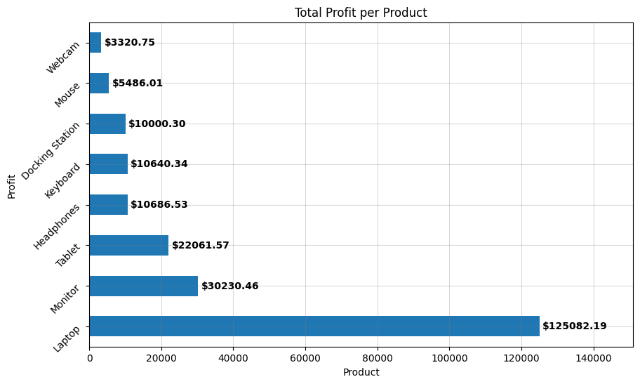
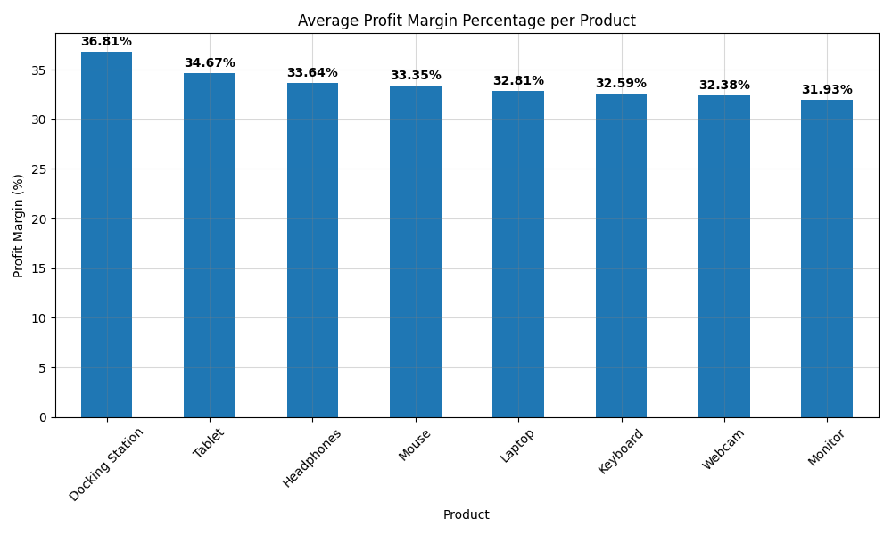
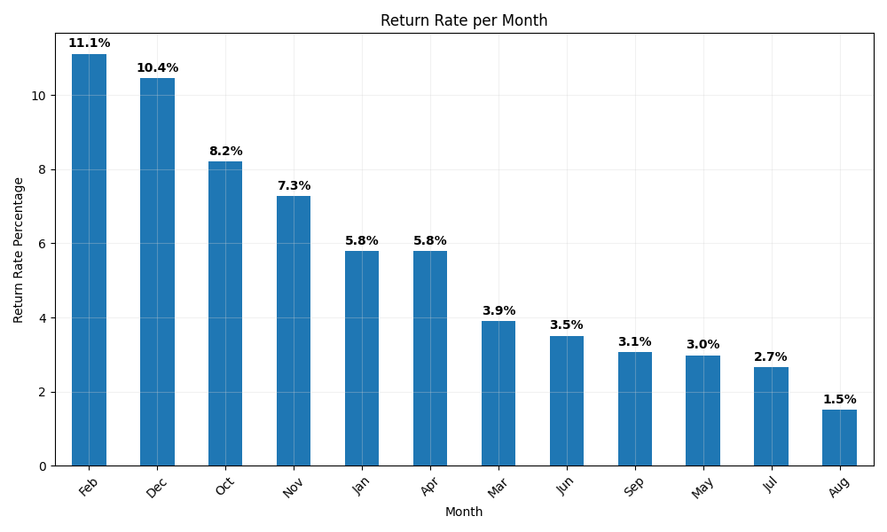
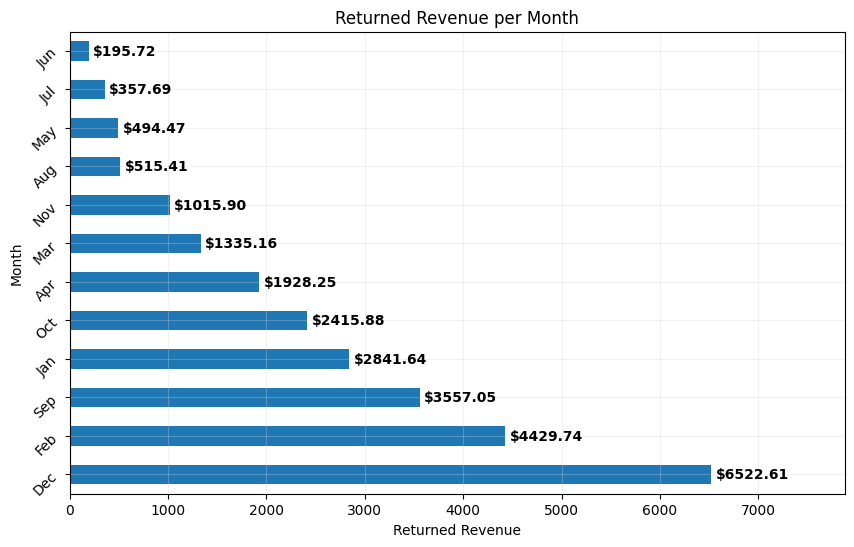
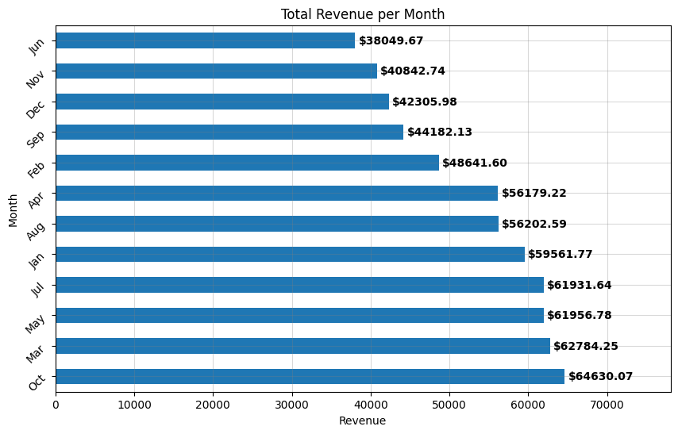

# Return Impact Analysis - Sales & Profitability Study

**End-to-end analysis** of how product returns affect revenue, profit, and margins in a retail dataset. This project identifies high-performing products, high-risk segments, and actionable business recommendations using Python, Pandas, and SQL.

## Project Overview
This analysis examines 800+ sales orders to understand the financial impact of returns across products, regions, customer segments, and time periods. The goal was to answer critical business questions about profitability drivers and return-related risks.

## Technologies Used
- Python
- Pandas
- SQLite (SQL)
- Matplotlib
- openpyxl

## Key Insights

**Impact of Returns**
- Returned orders show significantly lower average revenue and profit compared to non-returned orders.
- Certain products and regions have disproportionately high return rates, creating notable financial drag.

**Product Performance**
- **Laptops** dominate in total revenue and profit.
- **Docking Station** stands out as highly efficient with strong margins and low/zero returns.
- **Webcam** is a weak performer — low revenue combined with high return rates.

**Segment & Regional Findings**
- Enterprise segment generates high volume but lower average profitability.
- Small Business segment shows stronger profit margins.
- South Florida and Southwest regions show elevated return activity.

**Monthly Trends**
- December and February show higher return rates and increased losses.
- August performs strongly with solid revenue and lower returns.

## Visualizations









## Actionable Recommendations
1. Prioritize quality control and customer expectations for Webcam and other high-return products.
2. Promote Docking Station more aggressively. It's very stable with excellent margins and low return risk.
3. Review return policies or support processes in South Florida and Southwest regions.
4. Develop targeted strategies to improve profitability in the Enterprise segment.
5. Prepare inventory and support resources for higher return volumes in December/February.

## Limitations & Future Work
- Dataset is synthetic and limited in size.
- No customer review text or detailed return reasons available.
- **Next step**: Convert key insights into an interactive Power BI or Tableau dashboard.

See [detailed_analysis.md](detailed_analysis.md) for the full list of business questions and detailed findings.

## How to Run
```bash
pip install -r requirements.txt
python analysis.py
